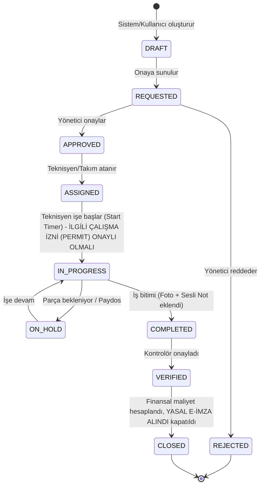

# Software Requirements Specification (SRS) - Maintenance & Work Order Modules

## 1. Giriş
Maintenance ve Work Order modülleri, sahadaki bakım operasyonlarını yürütür. 

## 2. Mobil Teknisyen Arayüzü (Kritik Gereksinimler)
Sahadaki teknisyenlerin işini zorlaştırmamak adına mobil uygulama (React Native tabanlı) şu kurallara uymalıdır:
* **Basitleştirilmiş UI:** Ekranda sadece o an yapılması gereken iş adımı görünür. Karmaşık menüler gizlenir.
* **Offline-First (WatermelonDB):** Teknisyen asansör boşluğunda veya bodrumda internet koptuğunda iş emrini kapatabilmeli, parça düşebilmeli ve fotoğraf çekebilmelidir. İnternet geldiğinde arka planda çakışma çözümü (Conflict Resolution) ile senkronize olmalıdır.
* **Bas-Konuş (Push-to-Talk) & Sesli Not:** Teknisyen elleri yağlıyken not yazmak yerine "Ses Kaydet" tuşuna basılı tutarak konuşur. Bu ses kaydı (.mp3/.m4a) MinIO'ya yüklenir, aynı anda AI Platform (Whisper/Speech-to-Text) tarafından metne çevrilip "Çözüm Notu" olarak iş emrine yazılır.

## 3. Work Order State Machine (Durum Makinesi)
İş emirleri kesin kurallara bağlı bir durum makinesi ile yönetilir.

## 4. MoSCoW Önceliklendirmesi ve Kabul Kriterleri

### MUST HAVE (Olmazsa Olmaz)
* **Durum:** Bir iş emri aynı anda iki kişiye atanamaz. 
* **Kabul Kriteri:** LOTO (Lockout/Tagout) adımları ve PPE (Kişisel Koruyucu) onay kutucukları işaretlenmeden sistem `IN_PROGRESS` durumuna geçişe izin VERMEMELİDİR.
* **Kabul Kriteri (E-İmza - Yasal Geçerlilik):** Bir iş emri `CLOSED` durumuna geçerken yasal olarak geçerli bir imza alınmalıdır. Kabul edilen imza yöntemleri: **Mobil İmza** (KKTC/TR mobil imza altyapısı), **Elektronik İmza** (e-imza kartı/sertifikası) veya saha tabletinde alınan **ıslak imza** (tablet üzerinde çizilen ve görüntü olarak MinIO'ya yüklenen imza). `COMPLETED` veya `VERIFIED` durumundan `CLOSED`'a geçiş **SADECE** bu yasal imza kaydı iş emrine eklenmişse gerçekleşebilir; aksi halde sistem `CLOSED` geçişine izin VERMEMELİDİR.
* **Kabul Kriteri (Permit to Work Bağı):** Bir iş emri `IN_PROGRESS` durumuna geçmeden önce, HSE (İş Sağlığı ve Güvenliği) context'inde ilgili **Çalışma İzni (Permit to Work)** onaylı (approved) durumda olmalıdır. İzin tipleri: **Yüksekte Çalışma**, **Sıcak Çalışma** (kaynak/kesim), **Kapalı Alan** (confined space), **Elektrik** ve **LOTO** (Lockout/Tagout). İlgili permit onaylı değilse sistem `ASSIGNED --> IN_PROGRESS` geçişine izin VERMEMELİDİR.

### SHOULD HAVE (Olmalı)
* SLA ihlallerinde hiyerarşik eskalasyon (30 dk gecikmede Formen, 2 saat gecikmede Müdür).

## 5. Standard Job Library (JobPlanTemplate - Hazır Bakım Şablonları)
Sistem, bakım planlamasını hızlandırmak için `JobPlanTemplate` varlığı ile önceden tanımlı (pre-seeded) hazır bakım şablonlarıyla gelmelidir. Bu şablonlar; adım listeleri, tahmini süre, gerekli PPE/LOTO adımları, önerilen yedek parçalar ve ilgili Permit to Work tipini içerir. Teknisyen/planlamacı yeni bir iş emri oluştururken bu şablonlardan birini seçerek tüm iş adımlarını otomatik doldurabilir.

Türkiye'de yaygın ekipmanlar için sistemle birlikte gelen hazır şablon listesi:
* **Asansör:** Mavi Etiket / Yeşil Etiket periyodik bakım, A Tipi periyodik muayene (yıllık, TDK/akredite kuruluş). Adımlar: hidrolik/seviye kontrolü, kuyu ve makine dairesi kontrolü, fren testi, kurtarma prosedürü doğrulaması.
* **Yangın Söndürücü:** Yıllık dolum kontrolü, 5/10 yılda bir hidrostatik test (basınç testi), baskı/etiket kontrolü ve son kullanma tarihi takibi.
* **Jeneratör:** Haftalık yük testi, aylık yük testi; yakıt seviyesi/kondisyon, akü (voltaj/yük testi), yağ seviyesi, yağ/filtre değişimi, soğutma suyu ve kayış kontrolü adımları.
* **HVAC:** Split klima, VRF sistemi, AHU (Hava İşleme Ünitesi), FCU (Fan Coil Ünitesi), Chiller ve Cooling Tower bakım şablonları; filtre temizliği/değişimi, gaz basıncı kontrolü, kondenser/pompa kontrolü, algılama ve kontrol panosu testi.
* **Kalibrasyon Takibi:** Ölçüm cihazları ve sensörler için kalibrasyon periyodu, son kalibrasyon tarihi, sonraki tarih ve akredite kalibrasyon laboratuvarı referansı takibi şablonu.

## 6. Hata Senaryoları (Error Scenarios)
* **Offline Senkronizasyon Hatası:** Cihaz offline iken kullanılan yedek parça, online olunduğunda stokta 0 görünüyorsa; sistem Work Order'ı "Conflict" state'ine alır ve depo yöneticisine uyarı düşürür, teknisyenin işlemi silinmez.
